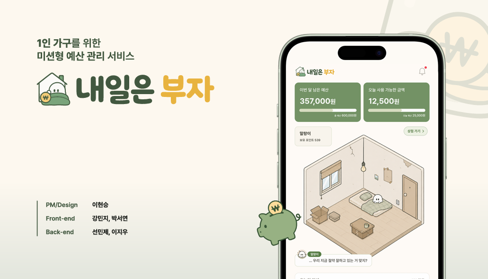
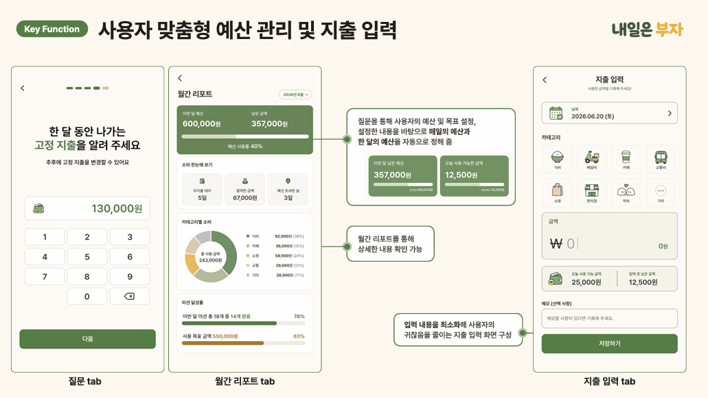
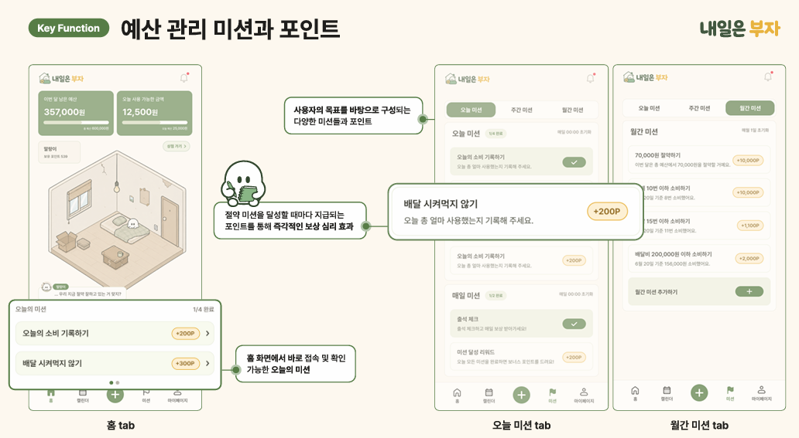
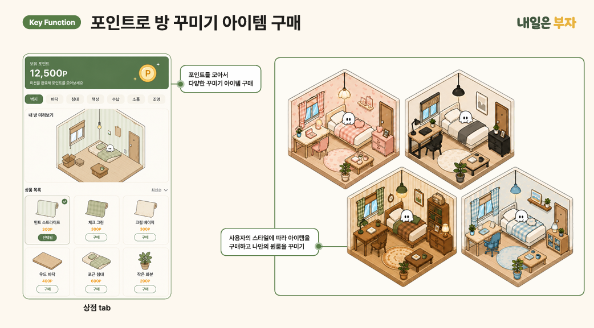
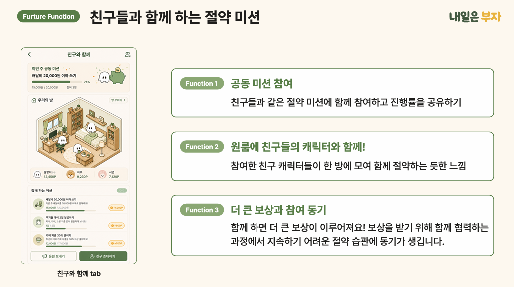

# 🏠 내일은 부자 - Backend

> **1인 가구를 위한 미션형 예산 관리 서비스**  
> 국민대 & 동덕여대 연합 해커톤 6팀 프로젝트  

<br>

> 이 저장소는 팀 프로젝트의 백엔드 레포지토리를 포트폴리오 용도로 정리한 fork repository입니다.

<br>

<div align="center">
  
</div>

---

## 프로젝트 소개

**내일은 부자**는 1인 가구와 자취생이 예산을 쉽게 관리하고,  
절약 미션을 통해 소비 습관을 형성할 수 있도록 돕는 서비스입니다.

사용자는 월 예산과 고정 지출을 설정하고,  
소비를 기록하며 미션을 달성해 포인트를 얻습니다.  
획득한 포인트는 캐릭터의 방을 꾸미는 데 사용할 수 있습니다.

---

## Service Concept

예산 관리와 절약 행동을 단순 기록이 아닌  
**미션, 포인트, 방 꾸미기 보상**으로 연결한 서비스입니다.

---

## 주요 기능

### 1. 예산 관리 및 지출 입력

월 예산, 고정 지출, 절약 목표를 바탕으로  
오늘 사용 가능한 금액과 남은 예산을 제공합니다.

<br>

<div align="center">
  
</div>

---

### 2. 절약 미션과 포인트

사용자의 목표에 맞는 절약 미션을 제공하고,  
미션 달성 시 포인트를 지급합니다.

<br>

<div align="center">
  
</div>

---

### 3. 포인트 기반 방 꾸미기

획득한 포인트로 아이템을 구매하고  
사용자만의 원룸을 꾸밀 수 있습니다.

<br>

<div align="center">
  
</div>

---

## 추후 확장 기능

### 친구들과 함께하는 절약 미션

친구들과 같은 미션에 참여하고 진행률을 공유하며,  
함께 절약하는 재미와 보상을 제공하는 기능입니다.

<br>

<div align="center">
  
</div>

---

## 🛠️ Tech Stack


---

## 구현

- JWT 기반 인증 / 로그인 구현
- 온보딩 정보 저장 API 구현
- 홈 화면 조회 API 구현
- 지출 등록 / 수정 / 삭제 API 구현
- 미션 조회 및 완료 처리 API 구현
- 포인트 내역 조회 API 구현
- 상점 아이템 조회 및 구매 API 구현
- 사용자별 데이터 접근 권한 검증

---

## 주요 API

| Domain | Method | Endpoint | Description |
|---|---|---|---|
| Auth | POST | `/api/auth/signup` | 회원가입 |
| Auth | POST | `/api/auth/login` | 로그인 |
| Onboarding | POST | `/api/onboarding` | 온보딩 저장 |
| Home | GET | `/api/home` | 홈 조회 |
| Expense | POST | `/api/expenses` | 지출 등록 |
| Expense | PATCH | `/api/expenses/{expenseId}` | 지출 수정 |
| Expense | DELETE | `/api/expenses/{expenseId}` | 지출 삭제 |
| Mission | GET | `/api/missions/today` | 오늘 미션 조회 |
| Point | GET | `/api/points/history` | 포인트 내역 조회 |
| Shop | GET | `/api/shop/items` | 상점 아이템 조회 |
| Shop | POST | `/api/shop/items/{itemId}/purchase` | 아이템 구매 |

---

## 실행 방법

```bash
git clone https://github.com/jiwoolee211/tomorrow-rich-BE.git
cd tomorrow-rich-BE
./gradlew bootRun
